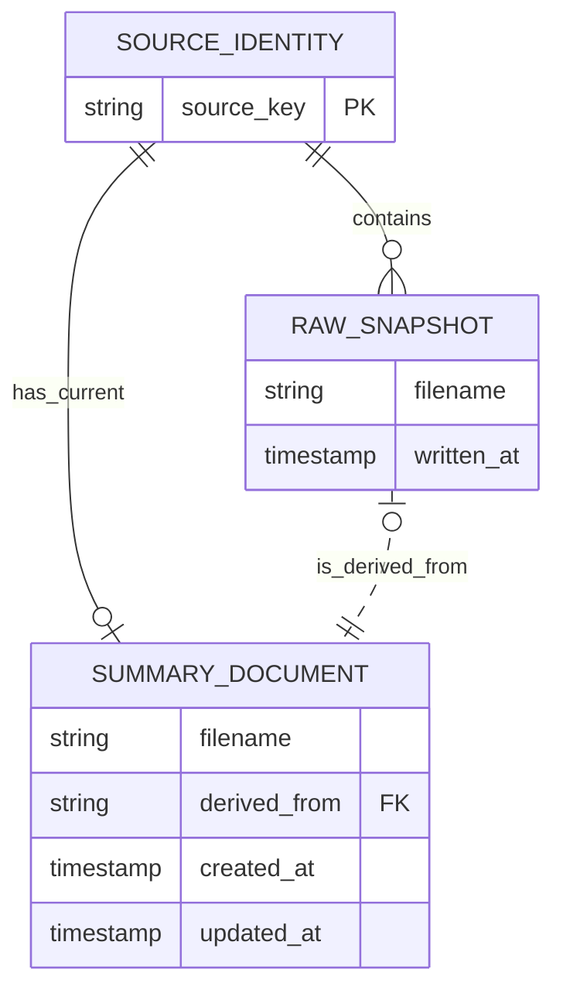

# Document ontology

`state.json` is the system-managed index for a seeded directory. It stores
one aggregate for each exact source identity:



## SourceIdentity

A source identity is the exact source key recorded by `bo snap`. HTTP and
HTTPS URLs without fragments are stored as-is. A Markdown file uses
`raw:<filename>` as its source identity. URL canonicalization is intentionally
deferred.

## SourceRecord

Each source aggregate contains zero or more immutable raw snapshots and at
most one current summary. Snapshot filenames are unique in the target
directory. A summary's `derived_from` value must identify one snapshot in the
same aggregate.

Timestamps use UTC RFC 3339 values throughout the state format:

```json
{
  "sources": [
    {
      "source_key": "https://example.com/foo",
      "snapshots": [
        {
          "filename": "foo--123456.md",
          "written_at": "2026-08-23T12:34:56.123456789Z"
        }
      ],
      "summary": {
        "filename": "foo.md",
        "derived_from": "foo--123456.md",
        "created_at": "2026-08-23T12:35:00Z",
        "updated_at": "2026-08-23T12:35:00Z"
      }
    }
  ]
}
```

State is validated when it is loaded and before it is published. Raw
snapshots remain append-only evidence. Rewriting a summary preserves its
filename and creation time, updates its timestamp, and replaces its
`derived_from` reference.

Document entries may also contain `content_digest`, `content_size`, and
`content_modified_at` inventory metadata for conditional writes. These fields
are not operation events.
