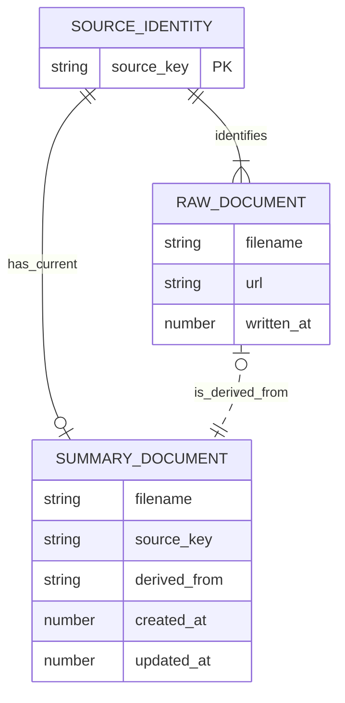

# Document ontology

`state.json` is the system-managed index for a seeded directory:



The diagram uses Mermaid ER cardinality notation: one source identity can
have many raw snapshots and at most one current summary. A summary derives
from exactly one raw snapshot, while older snapshots have no summary edge.

## SourceIdentity

A source identity is the exact URL string recorded by `bo snap`. URL
canonicalization is intentionally deferred. A Markdown file added without a
raw state record uses `raw:<filename>` as its source identity.

## RawDocument

Each successful snapshot is an immutable Markdown file in the target
directory. Its state record contains `filename`, `url`, and `written_at`.
Multiple raw records may have the same URL. The newest record by `written_at`
is the current evidence for that source; older snapshots remain available for
comparison and provenance.

## SummaryDocument

Each source identity has at most one current Markdown summary in `summaries/`.
Its state record contains:

```json
{
  "filename": "foo.md",
  "source_key": "https://example.com/foo",
  "derived_from": "foo--123456.md",
  "created_at": 123456,
  "updated_at": 123789
}
```

`derived_from` identifies the newest raw snapshot used for the current
summary. Rewriting a summary preserves `filename` and `created_at`, updates
`updated_at`, and replaces `derived_from`. Summary Markdown contains no
duplicated state metadata.

## Versioning and provenance

Raw documents are append-only evidence. Summary records are upserted by exact
`source_key`; a summary rewrite never deletes an older raw snapshot. State is
authoritative for the relationship between source identities, raw snapshots,
and summaries. Local state publication checks the generation of the exact
previous `state.json`; a concurrent change fails with a conflict.
